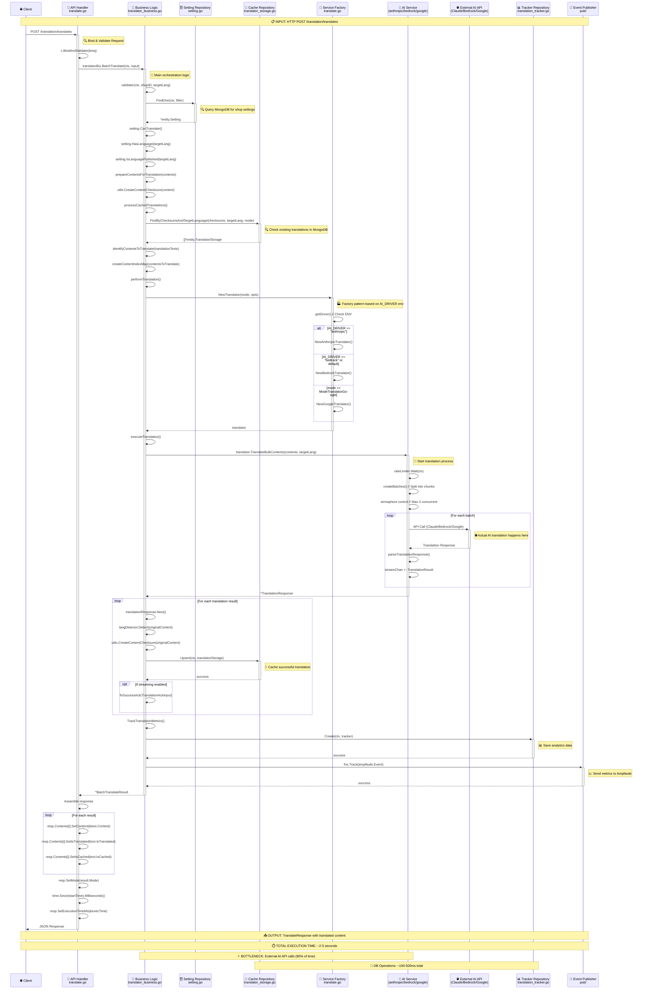

use mermaid to create call stack diagram, it should tell how function call each other, how the flow work.

Example

```mermaid
sequenceDiagram
    participant Client as 🌐 Client
    participant Handler as 🎯 API Handler<br/>translate.go
    participant BizLogic as 🧠 Business Logic<br/>translator_business.go
    participant SettingRepo as 🗄️ Setting Repository<br/>setting.go
    participant CacheRepo as 💾 Cache Repository<br/>translator_storage.go
    participant ServiceFactory as 🔧 Service Factory<br/>translate.go
    participant AIService as 🤖 AI Service<br/>(anthropic/bedrock/google)
    participant ExternalAPI as 🌐 External AI API<br/>(Claude/Bedrock/Google)
    participant TrackerRepo as 📊 Tracker Repository<br/>translation_tracker.go
    participant EventPub as 📢 Event Publisher<br/>pub/

    Note over Client, EventPub: 📋 INPUT: HTTP POST /translation/translates

    %% 1. Entry Point
    Client->>+Handler: POST /translation/translates
    Note right of Handler: 🔍 Bind & Validate Request
    Handler->>Handler: c.BindAndValidate(&req)
    
    %% 2. Business Logic Entry
    Handler->>+BizLogic: translatorBiz.BatchTranslate(ctx, input)
    Note right of BizLogic: 🎯 Main orchestration logic
    
    %% 3. Settings Validation
    BizLogic->>BizLogic: validator(ctx, shopID, targetLang)
    BizLogic->>+SettingRepo: FindOne(ctx, filter)
    Note right of SettingRepo: 🔍 Query MongoDB for shop settings
    SettingRepo-->>-BizLogic: *entity.Setting
    BizLogic->>BizLogic: setting.CanTranslate()
    BizLogic->>BizLogic: setting.HasLanguage(targetLang)
    BizLogic->>BizLogic: setting.IsLanguagePublished(targetLang)
    
    %% 4. Content Preparation
    BizLogic->>BizLogic: prepareContentsForTranslation(contents)
    BizLogic->>BizLogic: utils.CreateContentChecksum(content)
    
    %% 5. Cache Layer Check
    BizLogic->>BizLogic: processCachedTranslations()
    BizLogic->>+CacheRepo: FindByChecksumsAndTargetLanguage(checksums, targetLang, mode)
    Note right of CacheRepo: 🔍 Check existing translations in MongoDB
    CacheRepo-->>-BizLogic: []*entity.TranslatorStorage
    
    %% 6. Identify Contents to Translate
    BizLogic->>BizLogic: identifyContentsToTranslate(translationTexts)
    BizLogic->>BizLogic: createContentIndexMap(contentsToTranslate)
    
    %% 7. Translation Service Creation
    BizLogic->>BizLogic: performTranslation()
    BizLogic->>+ServiceFactory: NewTranslator(mode, opts)
    Note right of ServiceFactory: 🏭 Factory pattern based on AI_DRIVER env
    ServiceFactory->>ServiceFactory: getDriver() // Check ENV
    
    alt AI_DRIVER == "anthropic"
        ServiceFactory->>ServiceFactory: NewAnthropicTranslator()
    else AI_DRIVER == "bedrock" or default
        ServiceFactory->>ServiceFactory: NewBedrockTranslator()
    else mode == ModeTranslatorGoogle
        ServiceFactory->>ServiceFactory: NewGoogleTranslator()
    end
    
    ServiceFactory-->>-BizLogic: translator
    
    %% 8. Execute Translation
    BizLogic->>BizLogic: executeTranslation()
    BizLogic->>+AIService: translator.TranslateBulkContents(contents, targetLang)
    Note right of AIService: 🚀 Start translation process
    
    %% 9. Rate Limiting & Batch Processing
    AIService->>AIService: rateLimiter.Wait(ctx)
    AIService->>AIService: createBatches() // Split into chunks
    AIService->>AIService: semaphore control // Max 3 concurrent
    
    %% 10. External API Calls
    loop For each batch
        AIService->>+ExternalAPI: API Call (Claude/Bedrock/Google)
        Note right of ExternalAPI: 🌐 Actual AI translation happens here
        ExternalAPI-->>-AIService: Translation Response
        AIService->>AIService: parseTranslationResponse()
        AIService->>AIService: streamChan <- TranslationResult
    end
    
    AIService-->>-BizLogic: *TranslationResponse
    
    %% 11. Process Results
    loop For each translation result
        BizLogic->>BizLogic: translationResponse.Next()
        BizLogic->>BizLogic: langDetector.Detect(originalContent)
        BizLogic->>BizLogic: utils.CreateContentChecksum(originalContent)
        
        %% 12. Save to Cache
        BizLogic->>+CacheRepo: Upsert(ctx, translatorStorage)
        Note right of CacheRepo: 💾 Cache successful translation
        CacheRepo-->>-BizLogic: success
        
        %% 13. Success Callback (if streaming enabled)
        opt If streaming enabled
            BizLogic->>BizLogic: fnSuccessAck(TranslationAckInput)
        end
    end
    
    %% 14. Tracking & Analytics
    BizLogic->>BizLogic: TrackTranslationMetrics()
    BizLogic->>+TrackerRepo: Create(ctx, tracker)
    Note right of TrackerRepo: 📊 Save analytics data
    TrackerRepo-->>-BizLogic: success
    
    BizLogic->>+EventPub: fns.Track(amplitude.Event)
    Note right of EventPub: 📈 Send metrics to Amplitude
    EventPub-->>-BizLogic: success
    
    %% 15. Return Results
    BizLogic-->>-Handler: *BatchTranslateResult
    
    %% 16. Response Assembly
    Handler->>Handler: Assemble response
    loop For each result
        Handler->>Handler: resp.Contents[i].SetContent(&text.Content)
        Handler->>Handler: resp.Contents[i].SetIsTranslated(text.IsTranslated)
        Handler->>Handler: resp.Contents[i].SetIsCached(text.IsCached)
    end
    
    Handler->>Handler: resp.SetMode(result.Mode)
    Handler->>Handler: time.Since(startTime).Milliseconds()
    Handler->>Handler: resp.SetExecutionTimeMs(&execTime)
    
    %% 17. Final Response
    Handler-->>-Client: JSON Response
    Note over Client, EventPub: 📤 OUTPUT: TranslateResponse with translated content

    %% Add timing annotations
    Note over Client, EventPub: ⏱️ TOTAL EXECUTION TIME: ~2-5 seconds
    Note over BizLogic, AIService: ⚡ BOTTLENECK: External AI API calls (80% of time)
    Note over CacheRepo, TrackerRepo: 💾 DB Operations: ~100-500ms total
```
